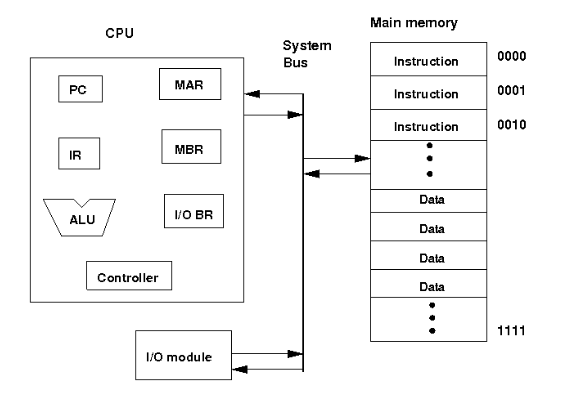
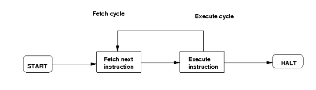

### Theory:

At the top level a computer consists of a CPU (central processing unit), memory, I/O components, with one or more modules of each type. These modules are interconnected in a specific manner to achieve the basic functionality of a computer i.e. executing programs. At the top level a computer system can be described as followes:

- describing the external behavior of each component i.e the data and the control signals that ir exchanges with other components
- describing the interconnection structure and the controls required

We are considering the Von Neumann architecture. Some of the basic features of this architecture are as follows:

- data and instructions are stored in a single read-write memory
- the contents of the memory are addressable by location
- execution occurs in a sequential manner (unless explicitly specified) from one instruction to the next

**Top level components and interactions among them:**

- CPU exchanges data with memory. For this CPU uses two internal resisters. Following is a block diagram of a basic computer system:

- Memory address register (MAR) which specifies the address for the next read or write
- Memory buffer register (MBR) which contains the data to be written into memory or receives the data read from memory
- I/O buffer (I/O BR) register is used for the exchange of data between an I/O module and the CPU

- A memory module consists of a set of a locations defined by sequentially numbered addresses. Each location contains a binary number that cam be interpreted as either an instruction or data.
- An I/O module transfers data from external devices to CPU and memory and vise versa
- The basic function of a computer is to execute a program which consists of a set of instructions stored in the memory. Processing required for a single instruction is called an instruction cycle which consists instruction fetch and instruction execute. A register called program counter (PC) holds the address of the next instruction. Unless told otherwise the processor always increments PC after each instruction fetch so that the next instruction is fetched in sequence. The fetched instruction is fetched into a register called instruction register (IR).

**The basic instruction cycle is shown in the following figure:**

- After fetching an instruction, processor execute the instruction by doing some processing on the data which may involve arithmetic and logic unit (ALU), specified by the instruction, then processor writes back the result (if any) to the memory.

This experiment provides a single instruction CPU with built-in controller. A working memory has been provided to check the working principle of the CPU. The single instruction which this CPU supports is SBN (subtract and branch if negative). The format of this instruction is:

- SBN a,b,c   Mem[a] = Mem[a] - Mem[b]   if(Mem[a] < 0) goto  c
- a,  b,  c are 4 bit addresses
- Mem[a] denotes the contents of memory address a
In this experiment, no I/O module has been included for the purpose of simplicity. The working memory should contain the programm and data in binary format. The CPU executes the programm. For halting, it uses self loop, no other halt instruction is provided.